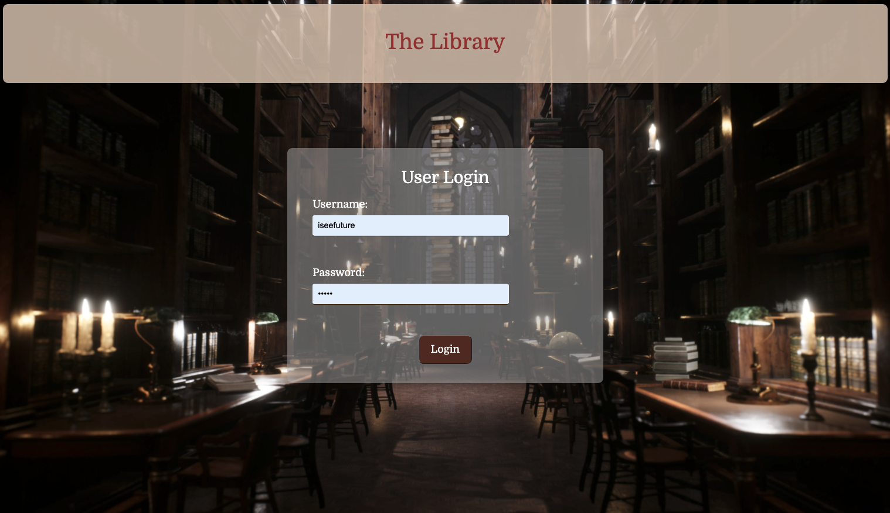
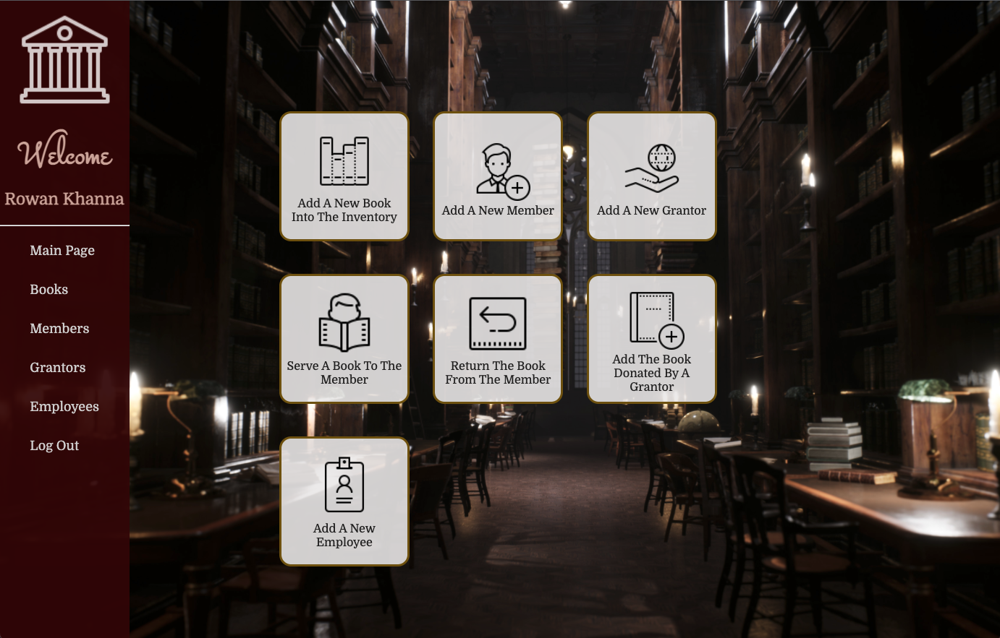
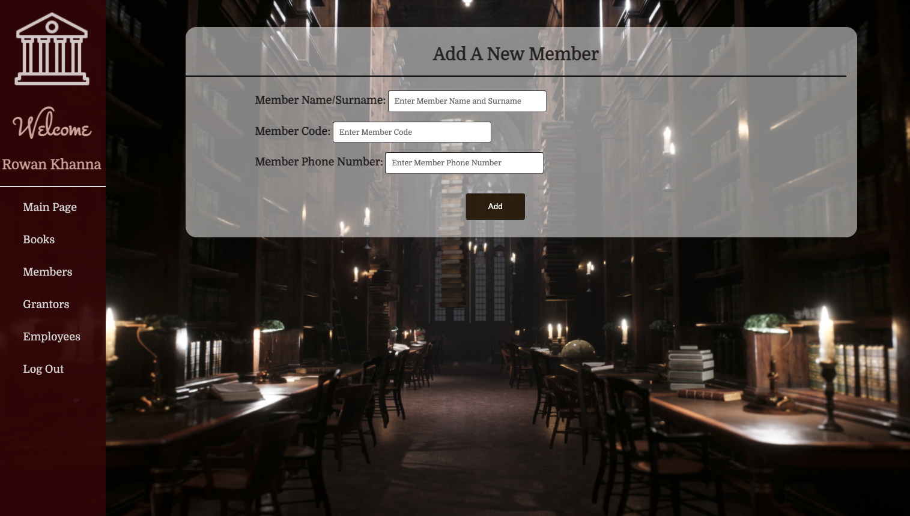
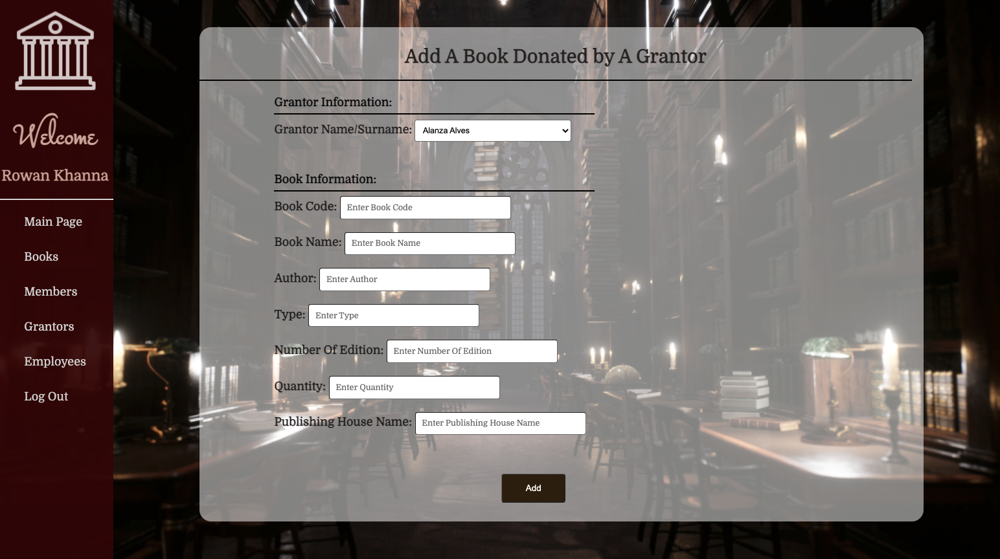
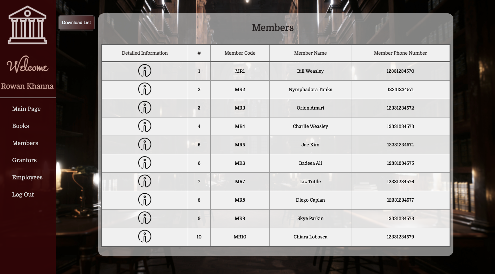
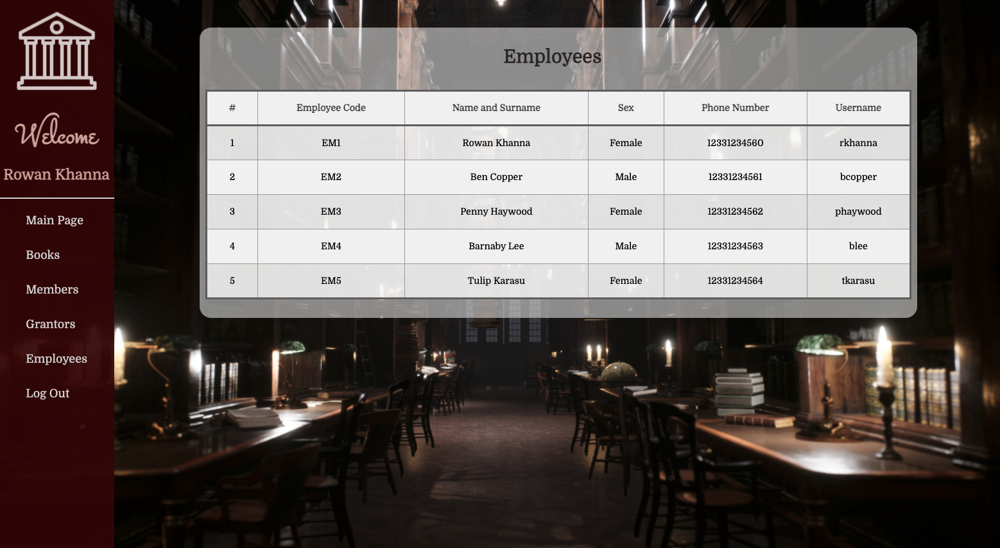

# TheLibraryWebApplication

This project is a system where employees of a library perform all the operations related to the library, such as adding new books to the inventory, serve books to the members.

# What can employees do in the system?

- do changes in the inventory (such as adding new books) and see all details of it
- download excels of the archive of books, members, grantors
- add new customers, serve them their books and take back the borrowed books
- add new grantors and their donated books to the archive
- add new employees to the system

## Notes

To run the project,

1. You should change the config.php file according to your own database
2. Then, you should run createTable.php file to create the tables of the database in localhost
3. After, you should run insert php files to fill the tables with the prepared information in localhost

## Gallery

